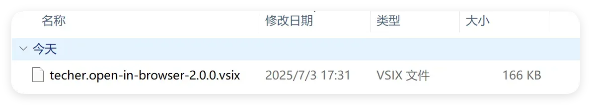

# 写作规范

这份文档记录写文章时要遵守的约定，以及这条流水线上所有已知的坑。
放在 `docs/` 根目录不会被当成文章（只有 `docs/blog/` 下的 `.md` 会发布）。

## 一、front matter

每篇文章必须以这段开头，字段顺序照抄：

```markdown
---
title: 文章标题
slug: my-post-slug
status: published
description: 一到两句话的摘要，会用在列表、分享卡片和 RSS 里。
category: 技术笔记
tags: [Node.js, 性能优化]
date: 2026-01-02
coverImage: images/cover-xx-og.png
updated: 2026-02-10
---
```

| 字段 | 必填 | 说明 |
|---|---|---|
| `title` | 是 | 标题。缺省会退回文件名（中文文件名会变成很难看的 URL） |
| `slug` | **是** | URL 片段，只能用小写字母、数字、连字符。**别省**，省了会用文件名，而文件名是中文 |
| `status` | 是 | `published` 才会发布；其它值（如 `draft`）会被直接过滤掉 |
| `description` | 是 | 摘要。用于列表页、`og:description`、RSS 与结构化数据 |
| `category` | 否 | 会进 `articleSection` 与 meta keywords |
| `tags` | 否 | 数组写法 `[A, B]`，会进 meta keywords、`article:tag` 与 RSS 的 `<category>` |
| `date` | 是 | **必须补零**：`2026-01-02` 合法，`2026-1-2` 会直接让构建失败 |
| `coverImage` | 否 | 只用于分享卡片与结构化数据，**不会显示在页面上**。必须是 1200×630 |
| `updated` | 否 | 修订日期，进结构化数据的 `dateModified`；不写就用 `date` |

两条硬规则：

1. **值里含 `: `、`#`、`【】` 或以特殊字符开头时，用双引号包起来**，避免 YAML 解析歧义。
2. 日期、slug、front matter 格式都有构建期校验，写错会让 `npm run build` 失败并指出文件名——
   这是好事，比生成一堆坏链接强。

## 二、图片与视频

图片放 `docs/images/`，视频放 `docs/videos/`，正文里用相对路径引用，构建时会自动同步到站点：

```markdown

```

**必须遵守的四条**：

| 规则 | 原因 |
|---|---|
| 文件名只用 `[a-z0-9._-]`，**不能有空格** | 带空格时 markdown-it 根本不解析这行，页面上会直接显示 `` 原文。中文名虽然能显示，但读不到宽高，会引入布局跳动 |
| 每张图都要写有意义的 `alt` | 截图就写「这一步在做什么」，纯装饰图写 ``。**不要留文件名当 alt**，读屏用户会听到一串哈希 |
| **alt 里不要写反斜杠** | markdown-it 会把反斜杠和它后面那个字符一起吃掉：`C:\dev\nvm` 会变成 `C:evvm`。需要写路径时用「C 盘 dev 目录下的 nvm 文件夹」这类自然语言 |
| 视频用绝对路径 `/videos/x.mp4` | 构建只改写 `images/` 前缀，相对路径的 `videos/` 会 404 |

其它约定：

- **只有 `.webp` 和 `.png` 会自动补 `width`/`height`**（从文件头读），其它格式要自己写，否则图片加载完会把下方内容顶下去。
- 图片在仓库外先转成 webp 再放进来（仓库里不做转换与压缩）。建议宽度 ≤1240px。
- **正文第一张图会被当作首屏大图**（`loading="eager"`），所以别在开头放装饰图。
- `coverImage` 是社交分享图，比例必须是 1200×630（1.91:1），否则微信/Twitter 会裁掉一大块。
  正文里继续用 webp，封面单独出一张 PNG。

## 三、Markdown 约定

- **围栏必须标语言**，目前支持 `bash`、`html`、`javascript`、`json`、`typescript`（简写 `ts`）。
  标了不支持的语言（如 `txt`）不会报错，只是保持纯文本不高亮。
- `---` 单独一行在正文里只作留白，**不会画线**。
- 任务清单**必须写紧凑**（列表项之间不要空行）：

  ```markdown
  - [ ] 未完成
  - [x] 已完成
  ```

  空行会让它变成松散列表，`[ ]` 就不会转成勾选框了。
- 正文标题从哪一级开始都行，构建时会自动归一化成 h2 起步（页面里的 h1 只留给文章标题）。
- 原始 HTML 是开启的（`<video>`、`<picture>` 之类可以用），但内容是自己写的，**风险自担**：
  别从别处整段粘贴带 `<script>` 或 `on*=` 的 HTML。

## 四、发布流程

```bash
cd app
npm run dev            # 本地预览（会自动同步图片）
# 如果提示「有 N 个新字符不在现有字体子集里」，说明用了字体里还没有的汉字：
npm run fonts          # 重新裁剪字体子集（改了文章就要考虑跑一次）
npm run build          # 产出 app/dist/
```

要点：

- **字体是按内容裁剪的自托管子集**。文章里出现新汉字而不重新裁剪，那个字会静默回退成系统字体，
  跟正文的霞鹜文楷混在一起。`prebuild` 会检查并在缺字时报错拦住构建，照着提示跑 `npm run fonts` 即可。
  确实想带着回退字形先构建，用 `node scripts/build-font-subset.mjs --check --allow-missing`。
- `npm run fonts` 需要联网下载一次完整字体（约 24MB，缓存在 `app/.cache/fonts/`，之后离线可用）。
- 部署就是把 `app/dist/` 整个目录传上去，详见 README 的「部署」一节。

## 五、代码注释规范

写文章不必在意，但改站点代码时请遵守。

**语言与标点**

- 中文注释。技术名词与标识符保持原文（`Shiki`、`unicode-range`、`readUIntLE`）。
- 全角标点；半角只出现在代码标识符内、行内代码里，以及纯 `//` 分隔行。
- 数字与单位之间不加空格：`252KB`、`1.05rem`、`1471 个码点`、`1200×630`。
- 区间统一用 `–`（不用全角 `～`）。

**句号**：单行 `//` 不加句号；段落式注释块内每句都加。

**必须写注释的地方**

1. 每个 `src/lib/*.js`、`scripts/*`、`astro.config.mjs`、`main.css` 的文件顶部，说明这个文件做什么。
2. 导出函数用 `/** */`，只写契约与「为什么」。
3. 非直观算法：给出数学推导或数据布局来源（例如 webp 三种容器的字节偏移）。
4. 魔法数字：`30`、`0x3fff`、`450`、`0.45`、字节偏移 `21/24/26/27/28`。
5. **顺序敏感的替换链**：`prepareHtml` 的三个 `replace`、实体解码里 `&amp;` 必须最后、
   XML 转义里 `&` 必须最先。这类地方改顺序不会报错，只会静默出错。
6. workaround 与依赖外部行为的写法。
7. CSS 分节。

**不要写**：复述下一行代码的注释、逐行翻译、没有 issue 链接的 TODO、给显而易见的结构加注释。
**不要用尾注释**，注释一律写在代码上方。

**格式**

| 场景 | 语法 |
|---|---|
| `.js` / `.mjs` | `//`，写在代码上方，与代码同缩进 |
| 文件级 / 导出函数 | `/** */`，每行以 ` * ` 开头 |
| `.astro` frontmatter | `//` |
| `.astro` 模板区 | `{/* */}` |
| `.css` | `/* */`，分节第一组选择器上方，前后各空一行 |

段落式注释：首行概括（≤40 字，带句号）+ `//` 空行 + 0–4 条细节，总长 ≤6 行；超过说明该抽函数。
范本见 [`app/src/lib/highlight.js`](../app/src/lib/highlight.js) 顶部。

**几个不可触碰的不变量**（改了就出事）：

- `app/src/lib/posts.js` 里 `prepareHtml` 的三个 `replace` 顺序
- `app/src/lib/highlight.js` 里实体解码的替换顺序
- `app/src/pages/rss.xml.js` 里 `escapeXml` 的替换顺序
- `app/src/styles/main.css` 里 `.prose pre.shiki span` 的选择器（与 Shiki 的输出结构绑定）
- `app/src/styles/fonts.css` 是生成物，**不要手改**（`--check` 靠反解它的 `unicode-range` 判断覆盖）
